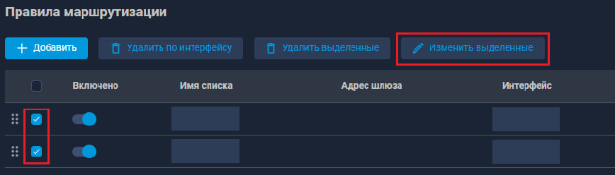
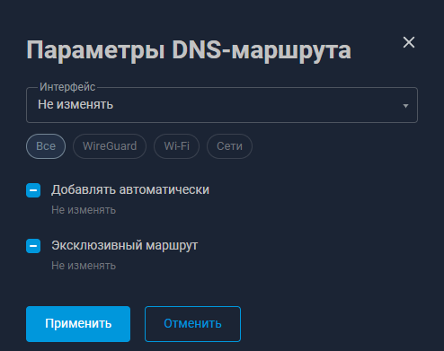

# Keenetic Routing Rule Switch

Расширение для Chromium-браузеров, которое добавляет массовое редактирование DNS-маршрутов в веб-интерфейс Keenetic (Netcraze).

## Оглавление

- [Возможности](#возможности)
- [Установка](#установка)
- [Использование](#использование)
- [Скриншоты](#скриншоты)
- [Структура проекта](#структура-проекта)
- [Поддерживаемые адреса Keenetic Web UI](#поддерживаемые-адреса-keenetic-web-ui)
- [Как работает сохранение](#как-работает-сохранение)
- [Ограничения](#ограничения)
- [Разработка](#разработка)

## Возможности

Расширение добавляет кнопку **«Изменить выделенные»** рядом с кнопкой **«Удалить выделенные»** в таблице DNS-маршрутов.

Для выбранных маршрутов можно массово изменить:

- интерфейс
- **«Добавлять автоматически»**
- **«Эксклюзивный маршрут»**

Для параметров с флажками доступны три состояния:

- **Не изменять** — оставить текущее значение каждого маршрута
- **Включить для всех**
- **Выключить для всех**

Список интерфейсов можно фильтровать с помощью chips:

- **Все**
- **WireGuard**
- **Wi-Fi**
- **Сети**

Интерфейс расширения стилизован под оригинальный Keenetic Web UI и использует его цветовые переменные.

## Установка

1. Скачайте или клонируйте проект.
2. Откройте страницу расширений браузера:
    - Chromium / Chrome: `chrome://extensions`
    - Яндекс Браузер: `browser://extensions`
3. Включите **Режим разработчика**.
4. Нажмите **«Загрузить распакованное расширение»**.
5. Выберите корневую директорию проекта, в которой находится `manifest.json`.
6. Обновите страницу веб-интерфейса Keenetic.

После изменения файлов расширения необходимо:

1. нажать кнопку перезагрузки расширения на странице расширений;
2. обновить страницу Keenetic.

## Использование

1. Откройте страницу DNS-маршрутов Keenetic.
2. Выберите несколько маршрутов в таблице.
3. Рядом с **«Удалить выделенные»** появится кнопка **«Изменить выделенные»**.
4. Откройте окно массового редактирования.
5. Выберите только те параметры, которые необходимо изменить.
6. Нажмите **«Применить»**.

Параметры со значением **«Не изменять»** сохраняют текущее значение каждого отдельного маршрута.

## Скриншоты

### Кнопка массового редактирования

После выбора нескольких маршрутов рядом с кнопкой удаления появляется кнопка **«Изменить выделенные»**.




### Диалог изменения маршрутов

В диалоге можно выбрать интерфейс и изменить параметры сразу для всех выделенных маршрутов.



## Структура проекта

```text
keenetic-routing-rule-switch/
├── manifest.json
├── icons/
│   ├── icon-16.png
│   ├── icon-32.png
│   ├── icon-48.png
│   └── icon-128.png
└── src/
    ├── content.js
    ├── dialog.js
    ├── rci.js
    ├── routes.js
    └── content.css
```

### `content.js`

Точка входа расширения.

Отвечает за:

- отслеживание изменений Keenetic SPA;
- добавление кнопки массового редактирования;
- открытие диалога.

### `dialog.js`

UI массового редактирования:

- выбор интерфейса;
- фильтры интерфейсов;
- tri-state checkbox;
- применение и отмена изменений.

### `rci.js`

Работа с Keenetic RCI API:

- загрузка интерфейсов;
- загрузка DNS-маршрутов;
- массовое сохранение изменений;
- сохранение конфигурации устройства.

### `routes.js`

Работа с таблицей маршрутов:

- поиск выбранных строк;
- сопоставление строк UI с маршрутами;
- проверка значений перед сохранением.

### `content.css`

Стили диалога, dropdown, chips и дополнительных элементов интерфейса.

## Поддерживаемые адреса Keenetic Web UI

Расширение подключается к веб-интерфейсу Keenetic на доменах, указанных в `manifest.json`, включая:

```text
*.keenetic.net
*.netcraze.link
*.netcraze.io
*.netcraze.club
*.crazedns.ru
*.netcraze.pro
```

## Как работает сохранение

Расширение использует тот же RCI endpoint, что и Keenetic Web UI:

```text
POST /rci/
```

Для выбранных DNS-маршрутов формируется пакет команд изменения, после чего выполняется сохранение конфигурации.

Поля, оставленные в состоянии **«Не изменять»**, не заменяются пользовательским значением — для них сохраняются текущие параметры маршрута.

## Ограничения

- Расширение рассчитано на текущую структуру Keenetic Web UI.
- После существенных изменений интерфейса Keenetic DOM-селекторы могут потребовать обновления.
- Значение интерфейса **«Любой»** в массовом редакторе пока не используется, поскольку его точное RCI-представление при сохранении отдельно не проверено.
- Расширение предназначено для DNS-маршрутов.

## Разработка

Проект не требует сборщика.

JavaScript-файлы подключаются напрямую через `manifest.json` в следующем порядке:

```json
"js": [
  "src/routes.js",
  "src/rci.js",
  "src/dialog.js",
  "src/content.js"
]
```

Для взаимодействия между файлами используется единый namespace:

```js
window.KRRS
```
